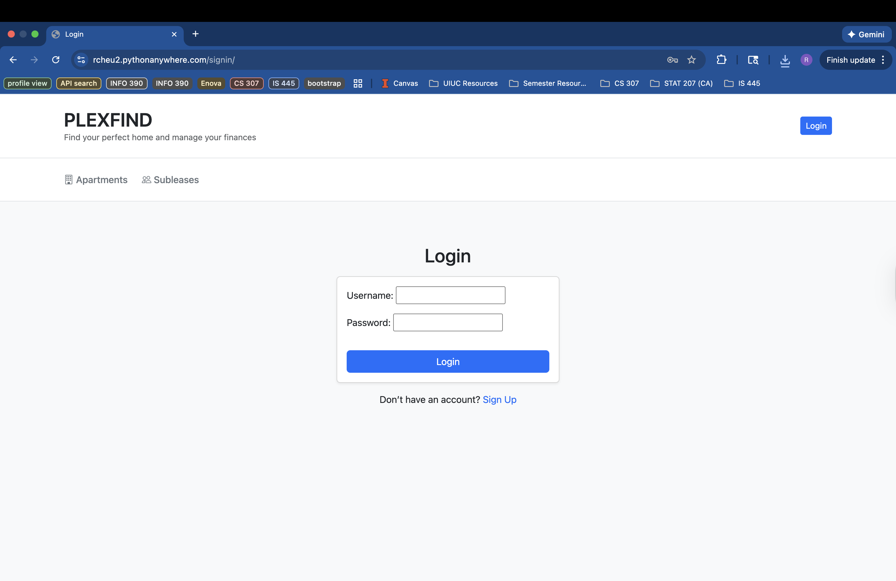
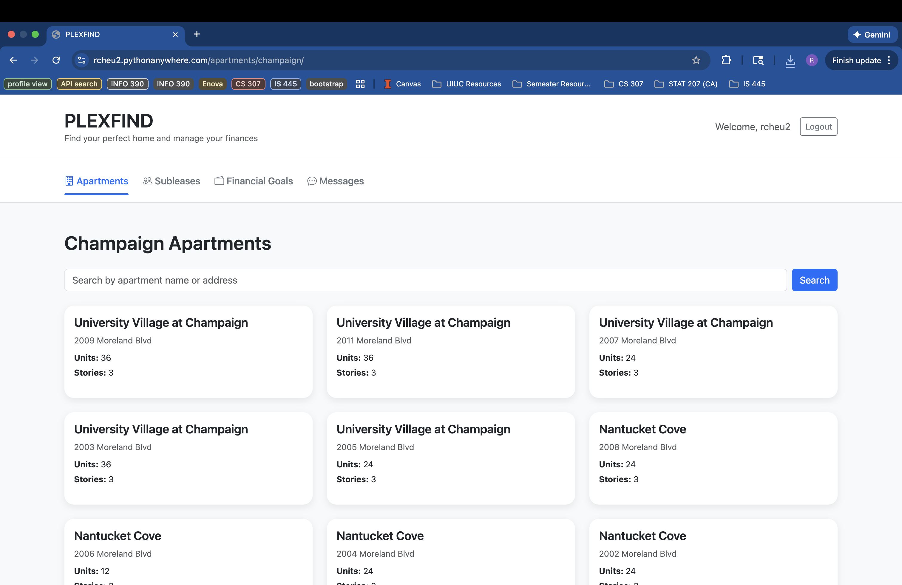
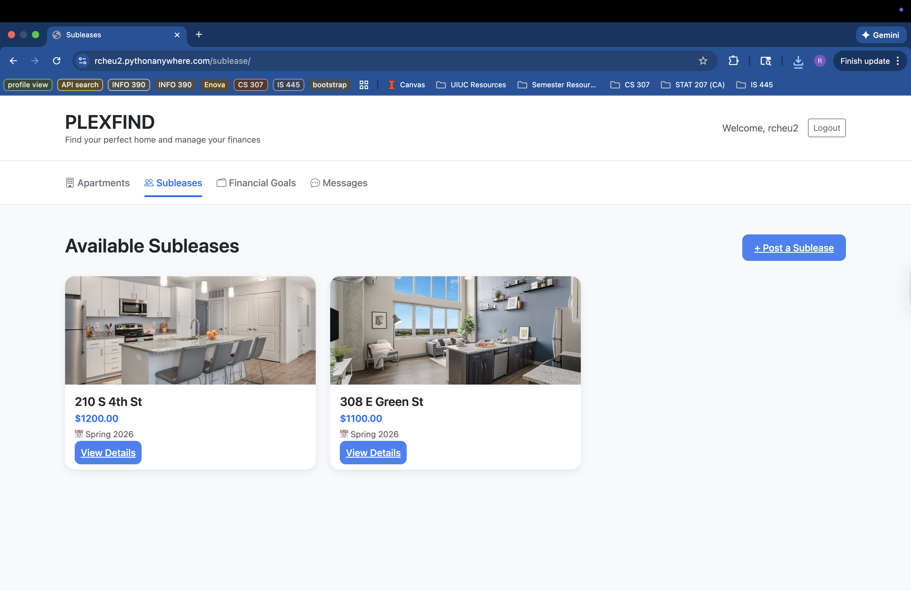
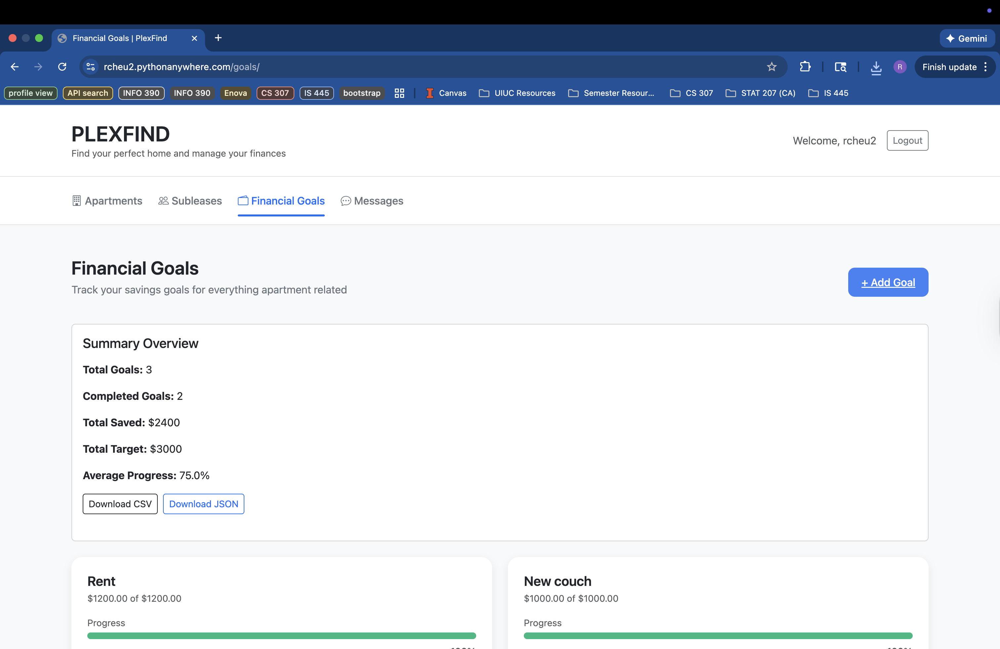
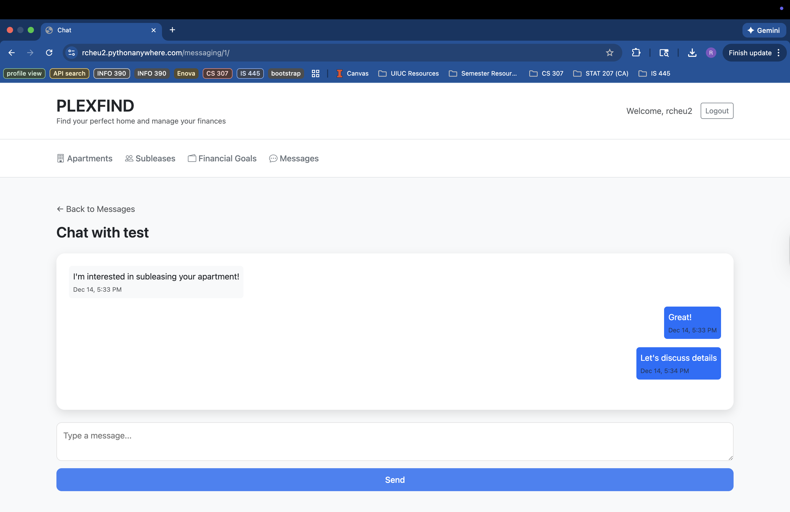

This project is a Django-based web application designed to streamline the apartment hunting and subleasing process for users. 
The goal is to create a centralized platform where users can browse available apartment complexes, post their own subleases, 
and track personal savings goals related to renting or furnishing an apartment.

Internal tester's login credentials: 
* Username: mohitg2
* Password: graingerlibrary

Internal guest's login credentials: 
* Username: infoadmins
* Password: uiucinfo

Topics implemented from Table 2:
- GitHub Repository, Environment Setup & Project Structure
- Wizard of Oz Prototyping / UI/UX Planning
- Models + ORM Basics
- Views + Templates + URLs (Function or Class-based)
- User Authentication for Internal Users
- Deployment (Production Setup)

Topics implemented from Table 3:
- ORM Queries + Data Summaries
- Static Files (CSS/JS Integration)
- Forms + Basic Input / CRUD
- Integrate External APIs
- Data Presentation & Export
- User Authentication for External Users

Web App Screenshots:

Statement of AI usage:
* AI was used in this project to help me create/update/modify features
I wanted to implement. Additionally, AI was used to help troubleshoot 
issues I faced, such as when I was being thrown an error, or when something
wasn't working the way I expected it to. Lastly, I used AI to help me with
the UI of my website since I am not proficient in using CSS or coding in HTML.